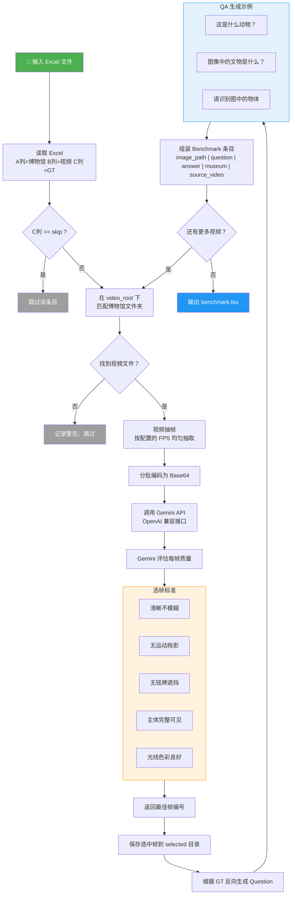

```mermaid
flowchart TD
    A["📂 输入 Excel 文件"] --> B["读取 Excel\nA列=博物馆 B列=视频 C列=GT"]
    B --> C{"C列 == skip ?"}
    C -- "是" --> D["跳过该条目"]
    C -- "否" --> E["在 video_root 下\n匹配博物馆文件夹"]
    E --> F{"找到视频文件？"}
    F -- "否" --> G["记录警告，跳过"]
    F -- "是" --> H["视频抽帧\n按配置的 FPS 均匀抽取"]

    H --> I["分批编码为 Base64"]
    I --> J["调用 Gemini API\nOpenAI 兼容接口"]

    J --> K["Gemini 评估每帧质量"]

    subgraph SELECT ["选帧标准"]
        direction LR
        S1["清晰不模糊"]
        S2["无运动拖影"]
        S3["无铭牌遮挡"]
        S4["主体完整可见"]
        S5["光线色彩良好"]
    end

    K --> SELECT
    SELECT --> L["返回最佳帧编号"]

    L --> M["保存选中帧到 selected 目录"]
    M --> N["根据 GT 反向生成 Question"]

    subgraph QA ["QA 生成示例"]
        direction LR
        Q1["这是什么动物？"]
        Q2["图像中的文物是什么？"]
        Q3["请识别图中的物体"]
    end

    N --> QA
    QA --> O["组装 Benchmark 条目\nimage_path | question | answer | museum | source_video"]

    O --> P{"还有更多视频？"}
    P -- "是" --> E
    P -- "否" --> Q["输出 benchmark.tsv"]

    style A fill:#4CAF50,color:#fff
    style Q fill:#2196F3,color:#fff
    style D fill:#9E9E9E,color:#fff
    style G fill:#9E9E9E,color:#fff
    style SELECT fill:#FFF3E0,stroke:#FF9800
    style QA fill:#E3F2FD,stroke:#2196F3
```
